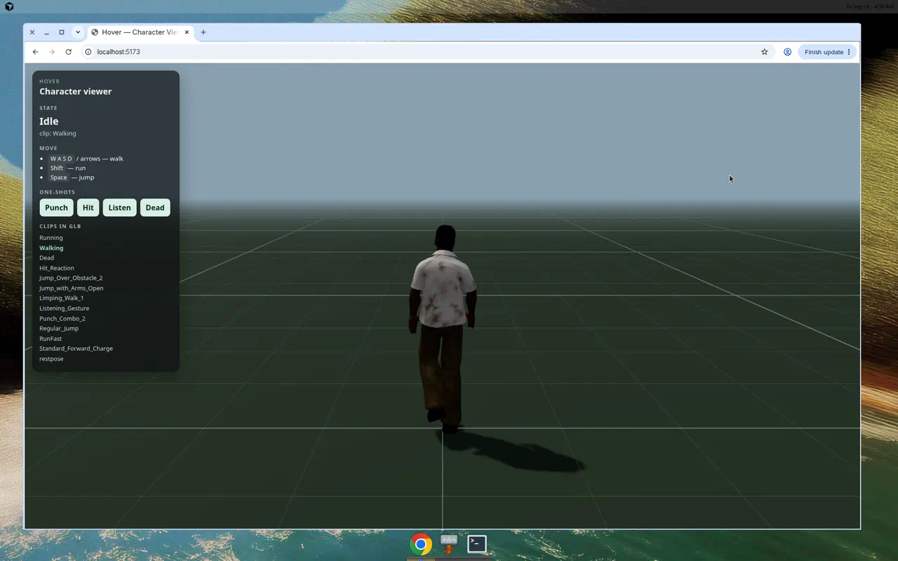
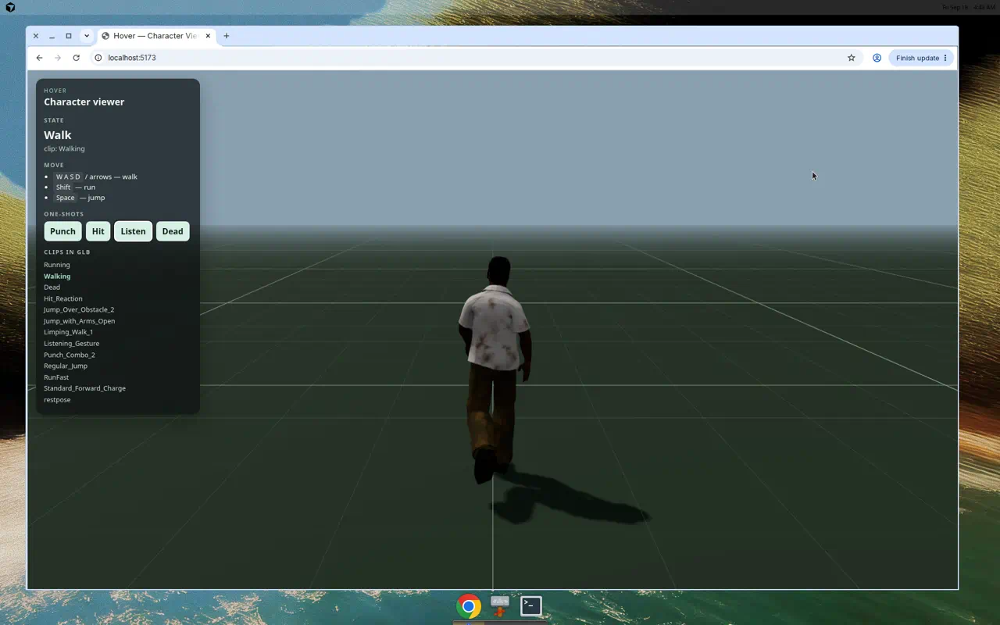
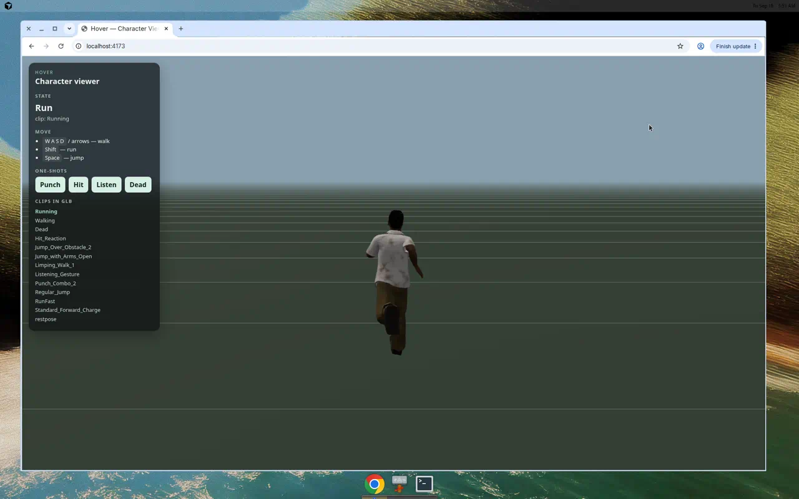

# Hover — Tiny Brawler

A small **Vite + TypeScript + vanilla Three.js** brawler. The Mixamo character at `public/models/character.glb` walks an arena and punches dummy enemies.

No React. No React Three Fiber. Entry: `index.html` + `src/main.ts`.

The original [Hover.css](README.hover-css.md) sources (`css/`, `scss/`, `less/`) and demo page (`hover-demo.html`) are still in this repo.

## Preview







[Demo video](docs/preview/demo.mp4)

## Setup

```bash
npm install
npm run dev
```

Open the URL Vite prints (default `http://localhost:5173`). The GLB is served from `/models/character.glb`.

Production build:

```bash
npm run build
npm run preview
```

## How to play

Four colored capsule dummies spawn around you. They walk in and deal contact damage.

| Input | Action |
| --- | --- |
| `W` `A` `S` `D` or arrows | Walk (camera-relative). `Shift` to run. |
| `Space` | Jump (`Regular_Jump`) |
| `F` or HUD **Punch** | Punch (`Punch_Combo_2`). Faces the nearest living enemy. |
| `R` | Restart the wave (also after win/lose) |

**Win:** knock out every dummy. **Lose:** HP hits 0 and the character plays `Dead`.

### Punch hit detection

`Punch_Combo_2` is a ~5.08s Mixamo combo. v1 does **not** use the whole clip as a hitbox.

- One attack window on the **first strike**: clip time **0.28s–0.78s**
- One hit per swing
- Target must be the nearest living dummy in front (~2.35 m, ~58° cone)
- Locomotion unlocks at **0.95s** so the long combo does not freeze you

Dummies take **2 punches**. Player has **5 HP**. Contact hits apply `Hit_Reaction` with a short cooldown.

## Animation clips

Inspected from the GLB (13 clips):

| Clip | Used as |
| --- | --- |
| `Walking` | Walk loop. Idle holds this clip at `t = 0` (`restpose` is 0.083s). |
| `Running` | Run (Shift) |
| `Regular_Jump` | Space |
| `Punch_Combo_2` | Attack |
| `Hit_Reaction` | Player took contact damage |
| `Dead` | HP reached 0 |

## Performance

The skinned mesh is **~115,730 verts / ~198,220 tris**. Desktop should be fine; **mobile may struggle**.

## Project layout

```
src/main.ts       loop + player
src/enemy.ts      dummy capsules
src/combat.ts     punch cone + contact
src/arena.ts      floor, walls, bounds
src/anim.ts       AnimationMixer helper
src/input.ts      keyboard
src/ui.ts         HUD / banners
src/constants.ts  tuning
```
